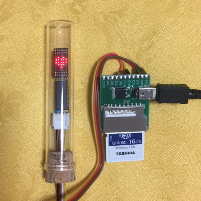
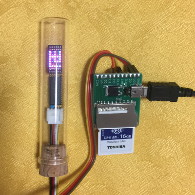

# Lua library for RGB5x7 module with TM1640 for FlashAir.

これはFlashAirで秋月電子の 超小型RGB ５×７ドットマトリクスモジュールに  
Titan Micro Electronics製LEDドライバ TM1640 をつないで制御するためのライブラリです。  
日本語表示も可能です。  
FlashAir W-04のファームウェア v4.00.03以降で動作します。  

超小型RGB ５×７ドットマトリクスモジュールについては以下をご参照ください。  
http://akizukidenshi.com/catalog/g/gM-13878/
http://akizukidenshi.com/catalog/g/gK-13706/

## インストール方法  

    lib/SlibRGB57wTM1640.lua  -- ライブラリ  
    sample.lua            　  -- サンプルプログラム  
    sample_kanji.lua          -- 日本語サンプルプログラム  
上記をFlashAir内の好きな場所においてください  

## FlashAirと部品のつなぎ方  

TM1640の標準電圧は+5Vです。  
手元の部品ではFlashAirと共通の3.3V電圧でも動作しましたが、保証の限りではありません。  
実際に回路を起こす際には、TM1640 のデータシートもご参照ください。
標準回路例には、DINとSCLKに10kΩのプルアップ抵抗をつけることや、VDDとVSSの間に0.1uFのパスコンと100uFの電解コンをつけることが記載されています。  

FlashAir(Pin#) | TM1640 | LEDモジュール | 備考
--- | --- | --- | ---
CLK (5) | ---   | ---  | Pull-down(10korm) to GND
CMD (2) | DIN   | ---  |
DAT0(7) | SCLK  | ---  |
DAT1(8) | ---   | ---  |
DAT2(9) | ---   | ---  |
DAT3(1) | ---   | ---  |
VCC (4) | ---   | ---  |
VSS(3,6)| VSS   | ---  |
5V      | VDD   | ---  |
 ---    | SEG1  | ROW0 |
 ---    | SEG2  | ROW1 |
 ---    | SEG3  | ROW2 |
 ---    | SEG4  | ROW3 |
 ---    | SEG5  | ROW4 |
 ---    | SEG6  | ROW5 |
 ---    | SEG7  | ROW6 |
 ---    | SEG8  | ---  |
 ---    | GRID1 | R0   |
 ---    | GRID2 | B0   |
 ---    | GRID3 | G0   |
 ---    | GRID4 | R1   |
 ---    | GRID5 | B1   |
 ---    | GRID6 | G1   |
 ---    | GRID7 | R2   |
 ---    | GRID8 | B2   |
 ---    | GRID9 | G2   |
 ---    | GRID10| R3   |
 ---    | GRID11| B3   |
 ---    | GRID12| G3   |
 ---    | GRID13| R4   |
 ---    | GRID14| B4   |
 ---    | GRID15| G4   |
 ---    | GRID16| ---  |

## 表示パタンデータの説明  

表示パターンは要素15の配列に R,G,Bの順に1行ずつ格納します。  
各要素は、7bitで文字の上端がLSB、下端がMSBで、点灯は1、消灯は0とします。  
例えば、5x7ドットの”F"  

    @@@@.  
    @....  
    @....  
    @@@@.  
    @....  
    @....  
    @....  

を白で表示する場合は、下記のように格納します。  

    bitmap	= {}  
    bitmap[ 1] = 0x7F -- 1111111  R0
    bitmap[ 2] = 0x7F -- 1111111  B0
    bitmap[ 3] = 0x7F -- 1111111  G0
    bitmap[ 4] = 0x09 -- 0001001  R1
    bitmap[ 5] = 0x09 -- 0001001  B1
    bitmap[ 6] = 0x09 -- 0001001  G1
    bitmap[ 7] = 0x09 -- 0001001  R2
    bitmap[ 8] = 0x09 -- 0001001  B2
    bitmap[ 9] = 0x09 -- 0001001  G2
    bitmap[10] = 0x09 -- 0001001  R3
    bitmap[11] = 0x09 -- 0001001  B3
    bitmap[12] = 0x09 -- 0001001  G3
    bitmap[13] = 0x00 -- 0000000  R4
    bitmap[14] = 0x00 -- 0000000  B4
    bitmap[15] = 0x00 -- 0000000  G4

## SlibRGB57wTM1640.lua の関数の説明  

関数 | 説明  
--- | ---  
SlibRGB57wTM1640:setup(bright,gpio,cfg,clk) | **TM1640の初期設定を行い、LEDの表示をクリアして、明るさを設定します。** **bright:** LEDの明るさを 0～8で設定します。0で消灯、8で最大輝度です。 **gpio:** LED通信に使わない端子の1/0状態を指定します。 ピンアサインは fa.pio()に準じます。省略時は0x00です。 **cfg:** LED通信時の端子のIO設定を変更します。 ピンアサインは fa.pio()に準じます。省略時は0x1Fです。 **clk:** SCLK信号の割り当てを変更します。 ピンアサインは fa.pio()に準じます。省略時は0x02です。  
SlibRGB57wTM1640:write(bitmap,gpio) |**ビットマップデータをLEDに転送します*** **bitmap:** ビットマップデータ **gpio:** LED通信に使わない端子の1/0状態を指定します。 ピンアサインは fa.pio()に準じます。省略時は前回の値を維持します。
SlibRGB57wTM1640:cls() | **LEDの表示をクリアします**
SlibRGB57wTM1640:setBright(bright)|LEDの明るさを設定します。** **bright:** LEDの明るさを 0～8で設定します。0で消灯、8で最大輝度です。

## サンプルコード  

sample.lua          -- ハートマークを表示します  
sample_kanji.lua    -- k6x8フォントを使って日本語メッセージを表示します  

### 日本語フォントを使う方法

日本語フォントを使う場合は、下記のレポジトリをご参照ください。  
https://github.com/AoiSaya/FlashAir_SlibJfont  

例として、"sample_kanji.lua"を実行する手順を以下に示します。  
上記レポジトリから以下のファイルを入手してFlashAirに保存します。  

    lib/SlibJfont.lua  -- ライブラリ  
    lib/Utf8Euc_jp.tbl -- UTF-8をEUC-JPに変換する際の変換テーブル  
    font/bdf2sef.lua   -- ファイル形式変換プログラム  

### サンプル用フォントの入手
[Little Limit](http://littlelimit.net/k6x8.htm)から  
k6x8bb02.tar.gz をダウンロードして解凍し、下記ファイルをfont/ の下に置きます。  
    3x8.bdf  
    k6x8.bdf  

次に bdf2sef.lua を編集して、末尾に  

    convBdf2Bin("3x8.bdf")  
    convBdf2Bin("k6x8.bdf")  
    
を追加してください。  
bdf2sef.lua を実行すると、font/ の下に "3x8.sef" と "k6x8.sef"が生成されます。  
この状態で "sample_kanji.lua" を実行すると、LED上に日本語が表示されます。  

## Licence  

[MIT](/LICENSE)  

## Author  

[GitHub/AoiSaya](https://github.com/AoiSaya)  
[Twitter ID @La_zlo](https://twitter.com/La_zlo)  
